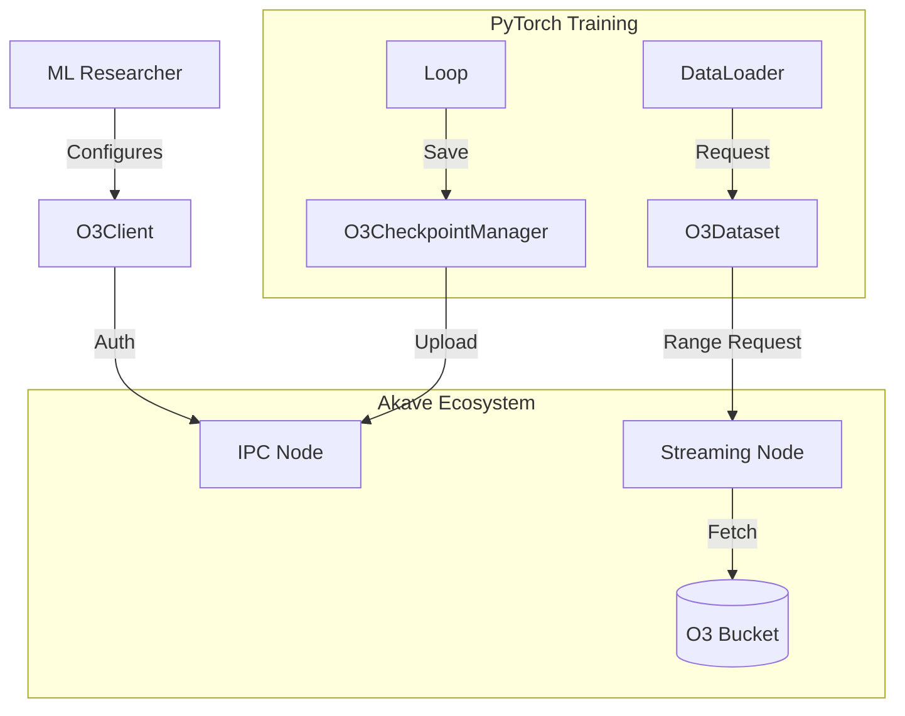
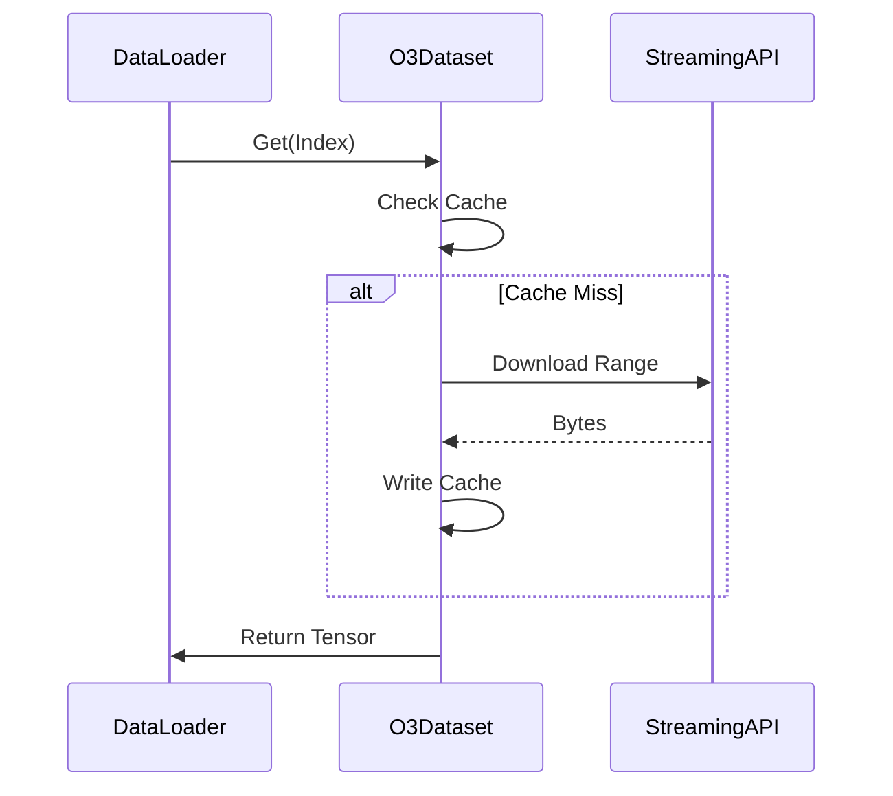

# PyTorch + Akave O3 Integration Plan

**Status**: Planning  
**Contributor**: Aryan Jain,  
**Date**: February 2026

## Objective
Build a **PyTorch-compatible training pipeline** where:
- **Datasets** are streamed directly from Akave O3 (Native SDK).
- **Checkpoints** are persisted immutably to Akave O3.
- **Lineage** is verified using content-addressed CIDs.

## Scope

### What it does
- **Native Streaming**: Integrates `akavesdk` to stream dataset chunks on-demand.
- **Drop-in Compatible**: Custom `O3Dataset` works with standard `torch.utils.data.DataLoader`.
- **Verifiable**: Every checkpoint has a unique Akave CID for provenance.
- **Resilient**: Built-in retries for network stability.

### What it does NOT do
- **Full Distributed Training**: No DDP/FSDP support in V1.
- **Model Serving**: Focus is strictly on training and persistence.

## Requirements Specification

### Functional Requirements (FRs)
1.  **Authentication & Session Management**
    - System must authenticate using an Ethereum Private Key.
    - System must maintain a persistent connection pool to Akave nodes.
    - System must gracefully handle connection teardown.
2.  **Data Ingestion (Streaming)**
    - System must allow random access (seek) to any byte offset in a remote file.
    - System must support partial file downloads (ranges) to minimize bandwidth.
    - System must expose a `torch.utils.data.Dataset` interface.
3.  **Persistence (Checkpointing)**
    - System must upload in-memory model buffers directly to Akave O3.
    - System must return a content-addressable Hash (CID) for every upload.
    - System must allow downloading a checkpoint using its CID.
4.  **Resiliency**
    - System must automatically retry failed network requests with exponential backoff.
    - System must cache frequently accessed data chunks locally (`LRU` policy).

### Non-Functional Requirements (NFRs)
1.  **Performance**
    - **Time-to-First-Byte (TTFB)**: Streaming requests should initiate within 200ms.
    - **Throughput**: Support parallel downloads (configurable concurrency) to saturate standard 1Gbps links.
    - **Overhead**: Dataset abstraction layer should add <5% CPU overhead compared to local file reading.
2.  **Reliability**
    - **Fault Tolerance**: Transient network failures (<5s) must not crash the training loop.
    - **Data Integrity**: Downloaded files must be verified against their checksums.
3.  **Security**
    - **Key Safety**: Private keys must effectively be treated as "read-only" secrets from environment variables; never logged.
    - **Isolation**: Workloads should be isolated by bucket prefix.
4.  **Usability**
    - **Drop-in**: Switching from `torchvision.datasets.ImageFolder` to `O3Dataset` should require changing <10 lines of code.
    - **Transparency**: Implementation details (IPC, gRPC) should be abstracted away from the ML researcher.

## High-Level Architecture

**The system replaces the local filesystem with Akave O3, using an intelligent caching layer to maintain high training throughput.**

### 1. O3Client (Connection Layer)
**A centralized wrapper around the Akave SDK that manages authentication and connection stability.**

**Core Capabilities:**
- **Auth**: Manages Ethereum Private Key + Node Endpoints.
- **Resiliency**: Retries failed IPC/Streaming calls automatically.
- **Lifecycle**: Ensures clean startup/shutdown of the SDK connection.

### 2. O3Dataset (Data Layer)
**A high-performance PyTorch Dataset implementation that streams data on-demand.**

**Core Capabilities:**
- **Metadata Caching**: Downloads and caches the file list (`ls`) locally to avoid repetitive blockchain calls.
- **Range Downloads**: Fetches exact byte ranges for specific samples.
- **Chunk Caching**: Stores downloaded segments on disk to speed up subsequent epochs.

**Example Workflow:**
1. `DataLoader` requests sample `index=42`.
2. `O3Dataset` calculates byte offset/length.
3. Checks local cache -> if miss, calls `streaming_api.download_range()`.
4. Returns data as PyTorch Tensor.

### 3. O3CheckpointManager (Persistence Layer)
**A utility class for saving and loading model states to the decentralized network.**

**Core Capabilities:**
- **Immutable Saves**: Uploads `state_dict` via IPC, returning a unique CID.
- **Auto-Resume**: Scans the bucket for the latest epoch and downloads it.
- **Verification**: Verifies hash integrity after download.

---

## tech stack

| Layer | Stack |
| :--- | :--- |
| **ML Framework** | PyTorch 2.0+ |
| **Storage SDK** | `akavesdk` (Python) v0.3.0 |
| **Protocol** | IPC / Streaming API |
| **Auth** | Ethereum (Private Key) |
| **Concurrency** | Python `threading` |

---

## architecture diagrams

### System View


### Data Loading Flow


## Implementation Milestones

### Milestone 1: Setup & Native SDK Integration
**Goal**: Establish environment and verify IPC connectivity.
- [ ] Initialize Python environment and `requirements.txt` (incl. `akavesdk`).
- [ ] Implement `O3Client` wrapper with retry logic.
- [ ] Verify bucket operations (Create/List) via `sdk.ipc()`.

### Milestone 2: O3Dataset with Range-Streaming
**Goal**: Enable partial file downloads for efficient data loading.
- [ ] Implement `O3Dataset` class using `StreamingAPI`.
- [ ] Implement chunk-level local caching (LRU).
- [ ] Benchmark data loading speed against standard `torchvision`.

### Milestone 3: Checkpoint & Recovery
**Goal**: Implement decentralized state persistence.
- [ ] Implement `O3CheckpointManager` with IPC upload.
- [ ] Add auto-resume functionality from latest CID.
- [ ] Detailed verifiability test (saving -> wiping local -> restoring).

### Milestone 4: End-to-End Reference & Docs
**Goal**: Finalize deliverables and user guidance.
- [ ] Create `examples/train_mnist.py` using the full O3 stack.
- [ ] Document `AKAVE_PRIVATE_KEY` setup.
- [ ] Verify chaos engineering (kill process during training).

## 4. Detailed Design Specifications

### Project Layout
We will follow a standard, packaging-friendly Python structure.
```bash
pytorch-o3/
├── src/
│   └── pytorch_o3/
│       ├── __init__.py
│       ├── client.py          # O3Client wrapper
│       ├── dataset.py         # O3Dataset (torch.utils.data.Dataset)
│       └── checkpoint.py      # O3CheckpointManager
├── examples/
│   └── train_mnist.py         # E2E Reference Implementation
├── tests/
│   ├── test_client.py         # Connection tests
│   ├── test_dataset.py        # Streaming logic tests
│   └── test_checkpoint.py     # Upload/Download verification
├── requirements.txt
├── README.md
├── PLAN.md
└── pyproject.toml
```

### Error Handling Strategy
- **Custom Exceptions**:
  - `O3AuthError`: Invalid private key or connection failure.
  - `O3StreamError`: Failure to fetch byte range after max retries.
  - `O3IntegrityError`: Downloaded file hash does not match CID.
- **Retry Policy**:
  - `wait_exponential(multiplier=1, min=4, max=10)`
  - Stop after 5 attempts.

### Logging Strategy
- Use Python's standard `logging` library.
- **Levels**:
  - `INFO`: Session start, Checkpoint uploaded (with CID).
  - `DEBUG`: Byte ranges requested, Cache hits/misses.
  - `ERROR`: Connection drops, Retry attempts (with traceback).
- **Format**: `[%(asctime)s] [pytorch-o3] [%(levelname)s] %(message)s`

### Testing Strategy
1.  **Unit Tests**:
    - Mock `akavesdk` to test `O3Dataset` logic without network.
    - Verify caching behavior and offset calculations.
2.  **Integration Tests**:
    - Connect to live Akave Node (requires `AKAVE_PRIVATE_KEY` in CI env).
    - Perform real Upload -> Download roundtrip.
3.  **End-to-End**:
    - Run a mini-training loop (1 epoch) ensuring loss decreases and checkpoint saves.

## 5. Success Criteria
- **Native performance**: Range-streaming minimizes time-to-first-batch.
- **Verifiability**: Every checkpoint is uniquely identified by its Akave CID.
- **Usability**: Drop-in compatibility with standard PyTorch `DataLoader`.
