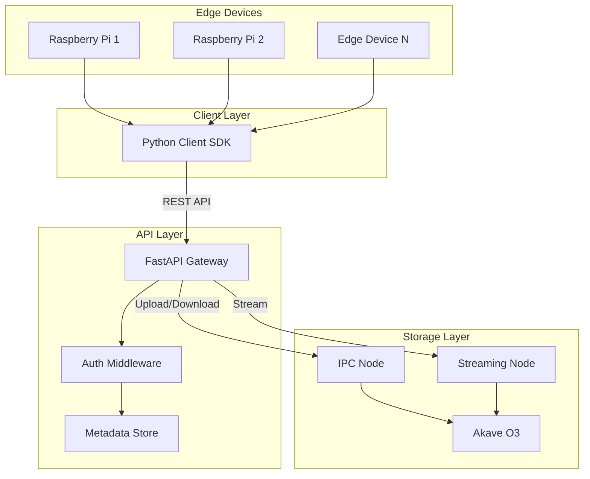
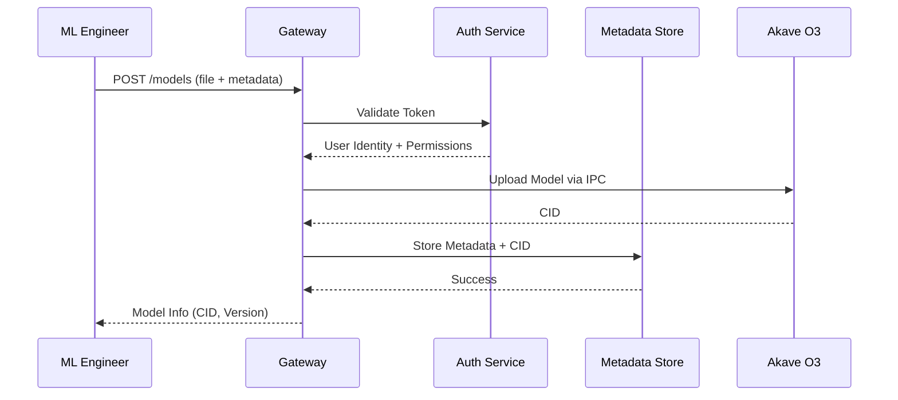
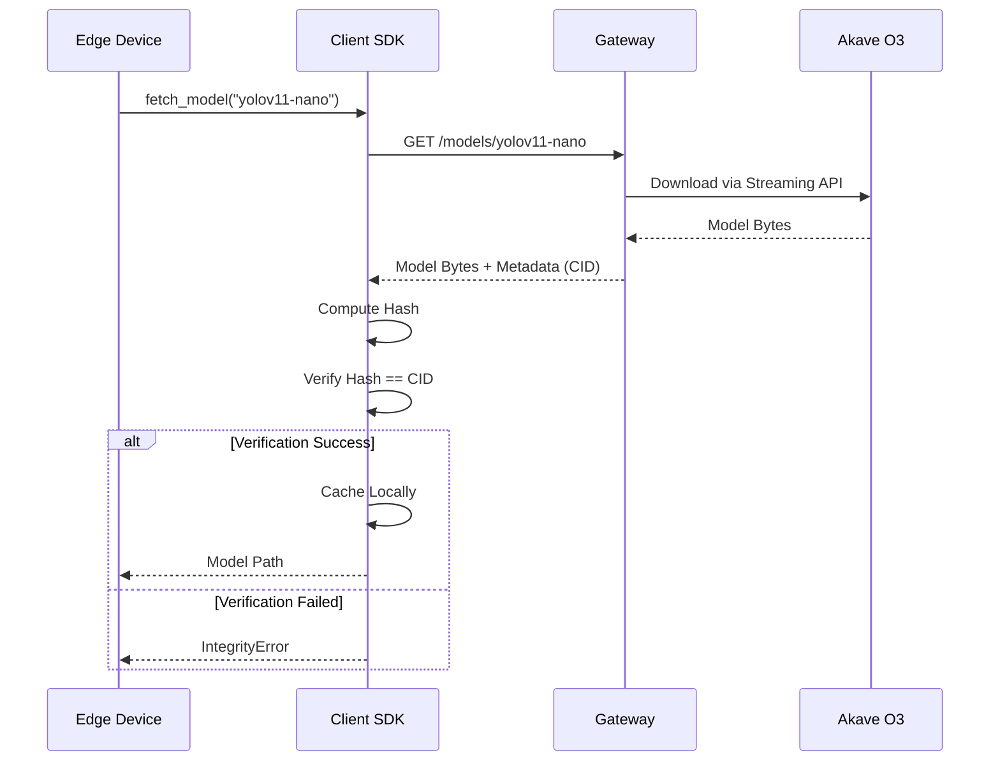

# Vision-O3: Edge-AI Model Registry & Verifiable CV Datasets - Implementation Plan

**Status**: Planning  
**Contributor**: KEERTHIVASAN S V
**Date**: February 2026

## Objective
Build a **decentralized edge-AI model registry** where:
- **Model artifacts** (.pt, .onnx, .tflite, .h5) are stored immutably on Akave O3
- **Training datasets** are versioned with content-addressed verification
- **Edge devices** fetch authenticated, CID-verified model updates via FastAPI gateway
- **ML engineers** collaborate on dataset curation with verifiable versioning

## Scope

### What it does
- **Decentralized Storage**: Stores model artifacts and datasets on Akave O3 with CID-based verification
- **Version Management**: Tracks multiple versions of models and datasets with full history
- **Edge Device SDK**: Lightweight Python client for fetching and verifying models
- **Authentication**: JWT-based auth with role-based permissions (read/write)
- **Metadata Management**: Queryable metadata separate from artifacts for fast discovery
- **Docker Ready**: Containerized FastAPI gateway for easy deployment

### What it does NOT do
- **Model Training**: No training infrastructure or compute orchestration
- **Model Serving**: No inference endpoints or model serving infrastructure
- **Real-time Updates**: Near real-time only, not hard real-time streaming
- **Enterprise SSO**: Basic JWT auth only, no advanced RBAC or SSO

## Requirements Specification

### Functional Requirements (FRs)

1. **Model Artifact Storage**
   - System must accept model uploads (.pt, .onnx, .tflite, .h5) with metadata
   - System must store artifacts on Akave O3 and return CID
   - System must validate file format matches declared model type
   - System must create new version when same name uploaded with different content

2. **Dataset Storage**
   - System must accept dataset uploads (.zip, .tar.gz, .json, .xml) with metadata
   - System must generate manifest of individual file CIDs for archives
   - System must version datasets with same name collision handling

3. **Artifact Retrieval**
   - System must support retrieval by name (latest version)
   - System must support retrieval by name + version number
   - System must support retrieval by CID
   - System must return metadata with all retrievals

4. **CID Verification**
   - Client SDK must compute content hash and verify against declared CID
   - Client SDK must reject artifacts with mismatched CIDs
   - Client SDK must cache verified artifacts locally

5. **Authentication & Authorization**
   - Gateway must require valid JWT tokens for all requests
   - Gateway must support role-based permissions (model:read, model:write, dataset:read, dataset:write)
   - Gateway must log all authenticated requests

6. **Metadata Management**
   - System must store queryable metadata separate from artifacts
   - System must support filtering by framework, model_type, format, tags
   - System must support pagination for large result sets

### Non-Functional Requirements (NFRs)

1. **Performance**
   - Model download should start within 500ms for cached metadata
   - SDK should add <10% overhead compared to direct HTTP downloads
   - Gateway should handle 100 concurrent requests

2. **Reliability**
   - Transient network failures must not crash operations
   - SDK must retry failed operations with exponential backoff
   - All artifacts must be verifiable via CID

3. **Security**
   - Private keys must be loaded from environment variables only
   - JWT tokens must expire after configurable duration
   - No sensitive data in logs or error messages

4. **Usability**
   - SDK should require <5 lines of code for basic operations
   - API should provide OpenAPI documentation at /docs
   - Error messages should be descriptive and actionable

## High-Level Architecture

**Vision-O3 uses a FastAPI gateway to manage metadata and proxy operations to Akave O3, while a lightweight Python SDK enables edge devices to fetch and verify models with automatic CID validation.**

### 1. FastAPI Gateway (API Layer)

**A lightweight REST API service that orchestrates all model and dataset operations, manages metadata, and proxies storage operations to Akave O3.**

**Core Capabilities:**
- **Authentication**: JWT token generation and validation
- **Authorization**: Role-based permission checks (model:read, model:write, dataset:read, dataset:write)
- **Model Service**: Upload, retrieve, list, and version models
- **Dataset Service**: Upload, retrieve, list, and version datasets
- **Metadata Management**: Store and query metadata separate from artifacts
- **O3 Integration**: Upload/download operations via Akave O3 SDK

**Key Modules:**
- `auth.py` - Authentication service with JWT token management
- `models.py` - Model service with upload, retrieval, versioning
- `datasets.py` - Dataset service with manifest generation
- `o3_client.py` - Akave O3 client wrapper with retry logic

**REST API Endpoints:**
```
POST   /auth/token                    # Generate JWT token
GET    /health                        # Health check

POST   /models                        # Upload model
GET    /models                        # List models
GET    /models/{name}                 # Get latest version
GET    /models/{name}/versions        # Get version history
GET    /models/{name}/versions/{ver}  # Get specific version
GET    /models/cid/{cid}              # Get by CID
GET    /models/{name}/download        # Download model

POST   /datasets                      # Upload dataset
GET    /datasets                      # List datasets
GET    /datasets/{name}               # Get latest version
GET    /datasets/{name}/versions      # Get version history
GET    /datasets/{name}/versions/{ver}# Get specific version
GET    /datasets/cid/{cid}            # Get by CID
GET    /datasets/{name}/download      # Download dataset
```

### 2. Akave O3 Storage Backend

**Decentralized, content-addressed storage for immutable model and dataset artifacts.**

**Core Capabilities:**
- **Immutable Storage**: Artifacts stored as immutable objects with CIDs
- **Content Addressing**: Each artifact uniquely identified by content hash
- **Streaming Support**: Large file downloads via streaming API
- **Bucket Organization**: Logical separation of models and datasets

**Bucket Structure:**
```
vision-o3/
├── models/
│   ├── yolov11-nano/
│   │   ├── v1.pt
│   │   ├── v2.pt
│   │   └── v3.pt
│   └── resnet50/
│       └── v1.onnx
└── datasets/
    ├── coco-subset/
    │   ├── v1.zip
    │   └── v2.zip
    └── custom-dataset/
        └── v1.tar.gz
```

### 3. Metadata Store (PostgreSQL / SQLite)

**Lightweight database for queryable metadata, enabling fast discovery without duplicating artifacts.**

**Schema Design:**
```python
class Model:
    id: UUID
    name: str
    current_version: int
    created_at: datetime
    owner_id: str

class ModelVersion:
    id: UUID
    model_id: UUID
    version: int
    cid: str
    framework: str
    model_type: str
    file_format: str
    file_size: int
    description: str
    tags: List[str]
    created_at: datetime

class Dataset:
    id: UUID
    name: str
    current_version: int
    created_at: datetime
    owner_id: str

class DatasetVersion:
    id: UUID
    dataset_id: UUID
    version: int
    cid: str
    format: str
    file_size: int
    manifest_cid: Optional[str]
    created_at: datetime

class User:
    id: str
    permissions: List[str]
    created_at: datetime
```

### 4. Python Client SDK (Edge Device Layer)

**Lightweight library for edge devices to fetch, verify, and cache models with automatic CID validation.**

**Core Classes:**
```python
class VisionO3Client:
    def __init__(gateway_url: str, api_token: str, cache_dir: str = "~/.vision-o3")
    
    # Model operations
    def list_models(filters: Optional[Dict] = None) -> List[ModelInfo]
    def get_model_info(name: str, version: Optional[int] = None) -> ModelInfo
    def download_model(name: str, version: Optional[int] = None, verify: bool = True) -> Path
    def download_model_by_cid(cid: str, verify: bool = True) -> Path
    
    # Dataset operations
    def list_datasets(filters: Optional[Dict] = None) -> List[DatasetInfo]
    def download_dataset(name: str, version: Optional[int] = None, verify: bool = True) -> Path
    
    # Cache management
    def clear_cache() -> None
    def get_cache_size() -> int

class CIDVerifier:
    @staticmethod
    def compute_cid(file_path: Path) -> str
    
    @staticmethod
    def verify_file(file_path: Path, expected_cid: str) -> bool
```

**SDK Features:**
- **Automatic Retry**: Exponential backoff for network failures
- **Local Caching**: LRU cache for verified artifacts
- **CID Verification**: Automatic hash verification on download
- **Progress Callbacks**: Optional progress reporting for large downloads

## Architecture Diagrams

### System Architecture


### Model Upload Flow


### Model Download with Verification


## Tech Stack

| Layer | Stack |
|-------|-------|
| **API Framework** | FastAPI + Uvicorn |
| **Storage SDK** | Akave SDK (Python) |
| **Database** | PostgreSQL / SQLite |
| **ORM** | SQLAlchemy |
| **Auth** | JWT (PyJWT) |
| **Validation** | Pydantic |
| **Testing** | Pytest + Hypothesis (property-based testing) |
| **Client SDK** | Python 3.8+ |
| **Containerization** | Docker + Docker Compose |
| **Logging** | Structured JSON logging |

**Key Dependencies:**
- `fastapi` - Web framework
- `uvicorn` - ASGI server
- `akavesdk` - Akave O3 integration
- `sqlalchemy` - ORM
- `pydantic` - Data validation
- `pyjwt` - JWT authentication
- `hypothesis` - Property-based testing
- `pytest` - Testing framework

## Implementation Milestones

### Milestone 1: Project Setup & Core Infrastructure
**Goal**: Establish project structure and core dependencies

- [ ] Initialize Python project with `pyproject.toml`
- [ ] Set up dependencies (FastAPI, akavesdk, SQLAlchemy, Pydantic)
- [ ] Create `.env.example` with required environment variables
- [ ] Set up pytest configuration with hypothesis settings
- [ ] Create Docker configuration for Gateway service
- [ ] Implement basic health check endpoint

### Milestone 2: Akave O3 Integration Layer
**Goal**: Build reliable connection to Akave O3 with retry logic

- [ ] Implement `O3Client` wrapper class
- [ ] Add connection management with private key auth
- [ ] Implement `upload()` method returning CID
- [ ] Implement `download()` and `download_stream()` methods
- [ ] Add exponential backoff retry logic
- [ ] Write unit tests for O3Client operations

### Milestone 3: Data Models & Database Schema
**Goal**: Define data structures and database schema

- [ ] Create Pydantic models for API requests/responses
- [ ] Create SQLAlchemy models for database tables
- [ ] Implement database initialization and migrations
- [ ] Add indexes for name, CID, and version lookups
- [ ] Write unit tests for data models

### Milestone 4: Authentication & Authorization
**Goal**: Implement secure authentication and role-based access control

- [ ] Implement JWT token generation and validation
- [ ] Create authentication middleware for FastAPI
- [ ] Implement role-based permission checks
- [ ] Add request logging for authenticated operations
- [ ] Write unit tests for auth flows

### Milestone 5: Model Service & Endpoints
**Goal**: Implement complete model management functionality

- [ ] Create `ModelService` class with upload/retrieve/list methods
- [ ] Add file format validation
- [ ] Implement version management and history
- [ ] Create FastAPI endpoints for all model operations
- [ ] Write unit and integration tests

### Milestone 6: Dataset Service & Endpoints
**Goal**: Implement dataset management with manifest generation

- [ ] Create `DatasetService` class
- [ ] Implement manifest generation for archives
- [ ] Add version management for datasets
- [ ] Create FastAPI endpoints for dataset operations
- [ ] Write unit and integration tests

### Milestone 7: Filtering, Pagination & Search
**Goal**: Enable efficient discovery of artifacts

- [ ] Implement filtering by framework, model_type, format, tags
- [ ] Add pagination support with page/page_size parameters
- [ ] Implement tag-based search
- [ ] Write property-based tests for filter correctness

### Milestone 8: Error Handling & Logging
**Goal**: Implement comprehensive error handling and structured logging

- [ ] Create structured JSON logging system
- [ ] Implement global exception handler
- [ ] Add request timeout handling
- [ ] Sanitize error messages for security
- [ ] Write tests for error scenarios

### Milestone 9: Python Client SDK
**Goal**: Build lightweight SDK for edge devices

- [ ] Implement `VisionO3Client` class
- [ ] Add CID verification utility
- [ ] Implement local caching with LRU policy
- [ ] Add retry logic with exponential backoff
- [ ] Write comprehensive SDK tests

### Milestone 10: Documentation & Examples
**Goal**: Provide clear documentation and usage examples

- [ ] Create example script for edge device usage
- [ ] Create example script for model upload
- [ ] Write comprehensive README with setup instructions
- [ ] Document API endpoints and SDK methods
- [ ] Create Docker deployment guide

### Milestone 11: Integration Testing & Demo
**Goal**: Validate end-to-end functionality

- [ ] Write integration tests for complete upload/download flow
- [ ] Test multi-version management
- [ ] Test permission-based access control
- [ ] Create demo scenario with real model artifacts
- [ ] Performance benchmarking

## Project Layout

```
vision-o3/
├── src/
│   └── vision_o3/
│       ├── __init__.py
│       ├── gateway/
│       │   ├── __init__.py
│       │   ├── main.py              # FastAPI app
│       │   ├── auth.py              # Authentication service
│       │   ├── models.py            # Model service
│       │   ├── datasets.py          # Dataset service
│       │   └── o3_client.py         # Akave O3 client wrapper
│       ├── sdk/
│       │   ├── __init__.py
│       │   ├── client.py            # VisionO3Client
│       │   └── verifier.py          # CID verification
│       ├── db/
│       │   ├── __init__.py
│       │   ├── models.py            # SQLAlchemy models
│       │   └── migrations/          # Database migrations
│       └── schemas/
│           ├── __init__.py
│           ├── models.py            # Pydantic models
│           └── datasets.py          # Dataset schemas
├── examples/
│   ├── upload_model.py              # Model upload example
│   └── edge_device.py               # Edge device SDK usage
├── tests/
│   ├── test_gateway/
│   ├── test_sdk/
│   └── test_integration/
├── docker/
│   ├── Dockerfile
│   └── docker-compose.yml
├── .env.example
├── pyproject.toml
├── README.md
├── PROPOSAL.md
└── PLAN.md
```

## Success Criteria

- [ ] Models and datasets reliably stored and retrieved from Akave O3
- [ ] CID verification working end-to-end in SDK
- [ ] Version management and history tracking functional
- [ ] Authentication and authorization enforced across all endpoints
- [ ] SDK provides drop-in integration with <5 lines of code
- [ ] Docker deployment working with single command
- [ ] Comprehensive test coverage (>85% for core logic)
- [ ] Documentation complete with examples

## Validation Goals

- Prove Akave O3 is suitable for edge-AI model distribution
- Demonstrate decentralized storage for reproducible ML workflows
- Showcase content-addressed verification for model integrity
- Validate Akave O3 for high-bandwidth binary artifacts
- Provide reference architecture for edge AI teams adopting Akave
